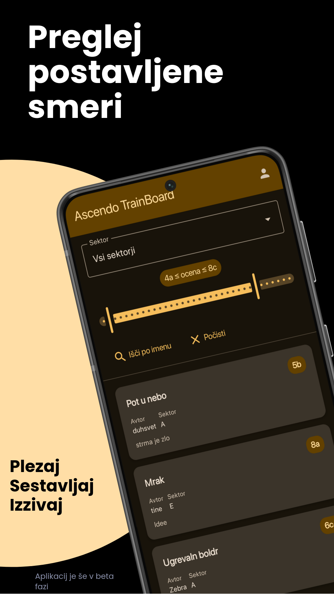
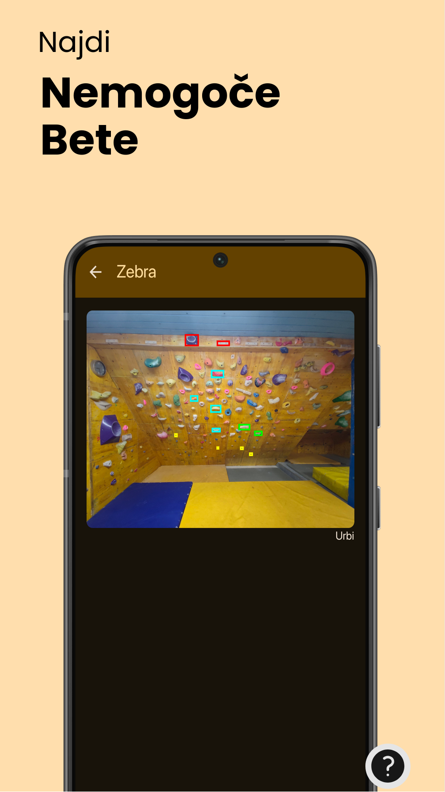
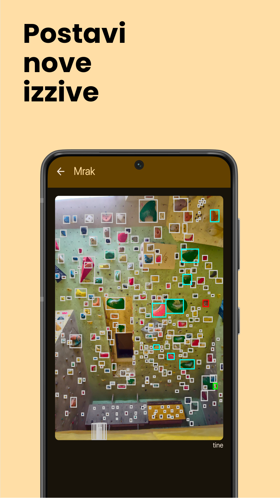

# AscendoTrainBoard

AscendoTrainBoard je samostojno gostovana aplikacija za beleženje balvanskih plezalnih problemov, ki jo uporablja naš plezalni klub. Uporabniki lahko dodajajo lastne plezalne probleme (balvane), jih pregledajo na slikah sektorjev z označenimi oprimki ter jim dodeljujejo težavnosti in ocene. Aplikacija spodbuja soustvarjanje in skupnostno ocenjevanje, obenem pa omogoča preprosto upravljanje in deljenje plezalnih smeri.

## Posnetki zaslona

|  |  |  |
|:---:|:---:|:---:|
| Preglej smeri | Prikaži opriimke | Ustvarjaj smeri |

## Glavne funkcije

* Prijava in registracija: Osnovni uporabniški računi z žetoni sej.
* Urejanje problemov: Dodajanje, spreminjanje in brisanje balvanov z natančnimi zaporedji oprimkov na vnaprej pripravljenih sektorjih.
* Sistem ocenjevanja: Uporabniki lahko predlagajo težavnosti in ocenjujejo probleme (1–5 zvezdic); povprečja se izračunajo samodejno.
* Upravljanje sektorjev: Statični sektorji z definiranimi oprimki in slikami, ki jih sistem zazna iz datotečnega sistema.
* Večplatformna aplikacija: Kotlin Multiplatform aplikacija za Android in splet, z enotno uporabniško izkušnjo.
* Lahka zaledna storitev: Strežnik v Rustu, optimiziran za naprave z zelo malo viri (ESP32, Raspberry Pi).
* Samostojno gostovanje: Popoln nadzor nad podatki in zasebnostjo.
* REST API: Celovito dokumentiran v OpenAPI specifikaciji.
* Administracija: Skrbniki lahko upravljajo vse probleme in uporabnike.

## Arhitektura

AscendoTrainBoard sestavljata dva glavna dela:

### Backend

Zaledni del je napisan v jeziku Rust. Njegov namen je zagotavljati REST API, upravljati uporabniške račune, skrbeti za shranjevanje podatkov ter streči slike posameznih sektorjev. Zasnovan je tako, da lahko deluje na napravah z zelo omejenimi viri, saj je velikost izvršljive datoteke približno 3–4 MB. Podatki se shranjujejo v JSON datotekah, ki vsebujejo informacije o uporabnikih, problemih in nastavitvah, sistem pa jih periodično samodejno shranjuje. Varnost je zagotovljena z razprševanjem gesel s SHA256 in soljo, avtentikacijo z nosilnimi žetoni (bearer) ter omejevanjem števila zahtevkov.
Za varno komunikacijo je treba dodati še HTTPS certifikat.

### Aplikacija (Frontend)

Odjemalska aplikacija je napisana v Kotlin Multiplatform in je namenjena delovanju na Android napravah ter v spletnih brskalnikih s pomočjo ogrodja Compose Multiplatform. Uporabnikom nudi vmesnik za pregledovanje sektorjev, ustvarjanje plezalnih problemov ter oddajanje ocen in težavnosti. Za komunikacijo z zalednim delom uporablja Kotlin modele, ki so samodejno generirani iz OpenAPI specifikacije.

## Navodila za začetek

Zahtevana orodja
* Rust razvojno okolje
* Kotlin Multiplatform (priporočen Android Studio)
* Node.js in npm (za OpenAPI generator)
